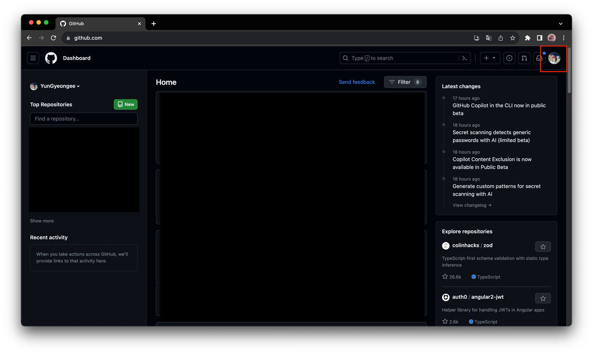
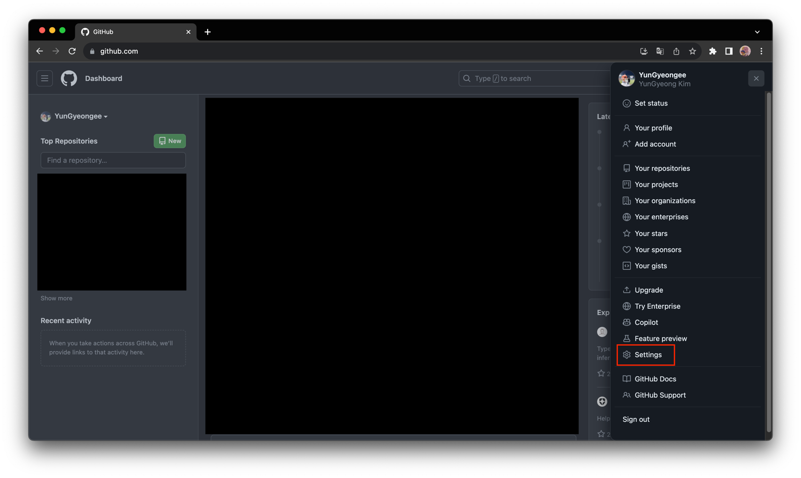
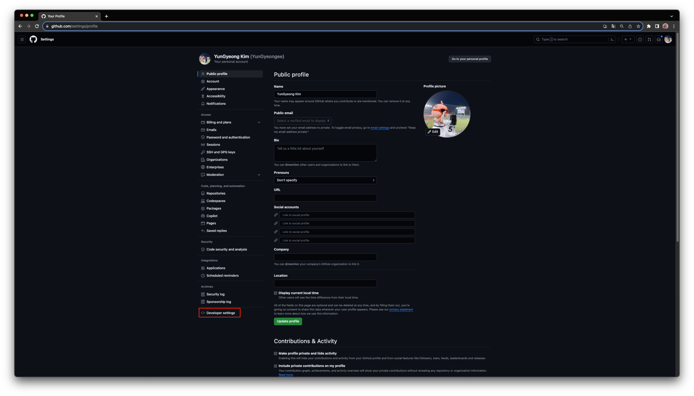
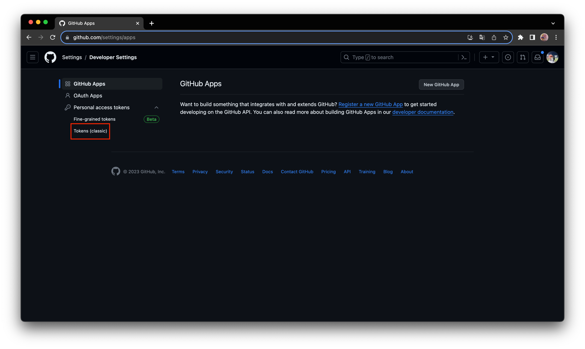
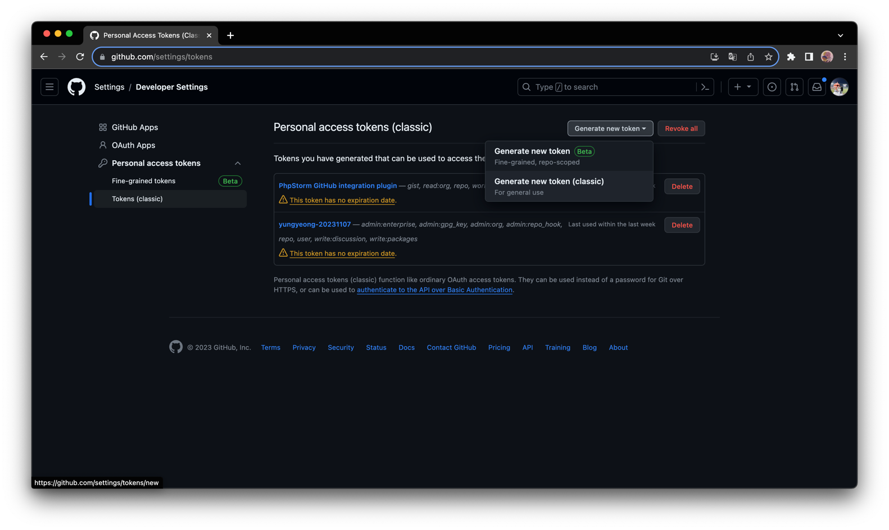

# create github token

- github 토큰 생성 방법

1. https://github.com 접속 후 오른쪽 상단 프로필 선택

2. Settings

3. Developer settings

4. Personal access tokens - Tokens (classic)

5. Generate new token - Generate new token (classic)

비밀번호 입력 후 토큰 이름 및 기간, 권한 설정 후 저장 

 ⭐️ 노출되는 토큰 꼭 복사해놓기 ⭐️ 

창 닫은 이후에 노출되지 않음
